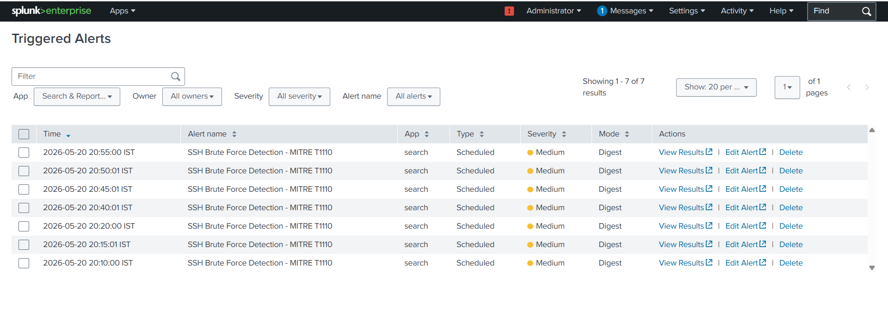
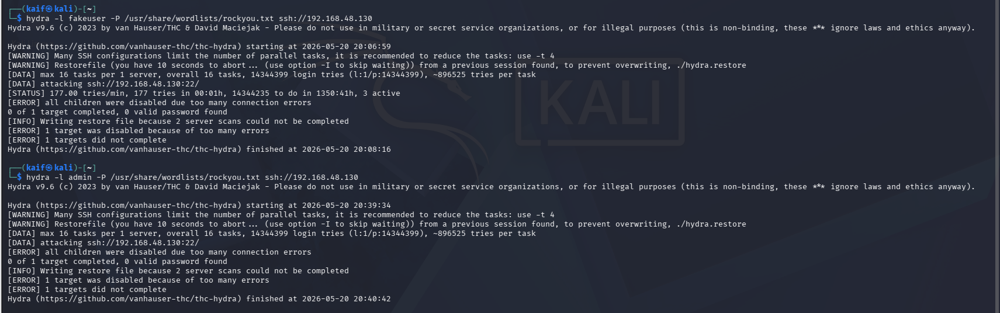
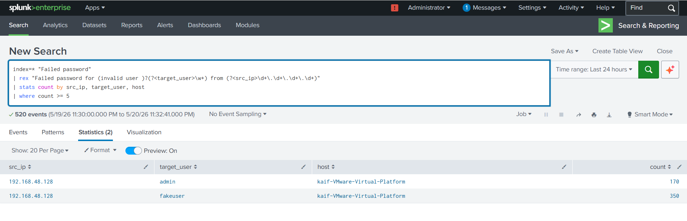
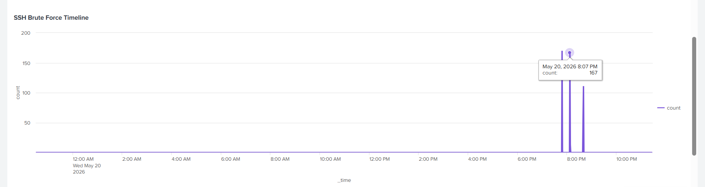
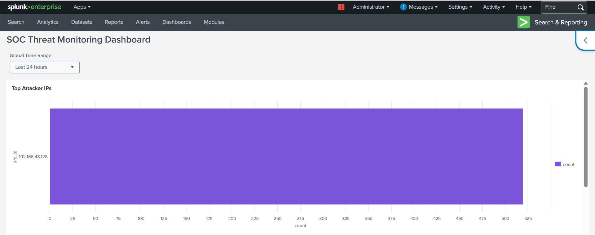
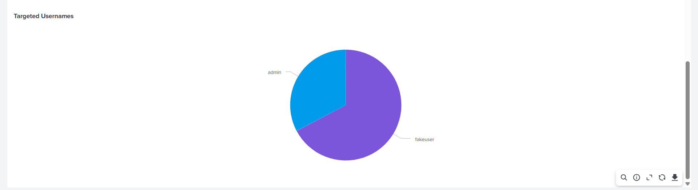

# Splunk SOC Threat Monitoring Dashboard

## Project Overview
This project demonstrates a SOC (Security Operations Center) threat monitoring lab built using Splunk Enterprise.

The lab simulates SSH brute-force attacks from Kali Linux using Hydra against an Ubuntu SSH server. Logs are collected and analyzed in Splunk to detect suspicious authentication attempts.

MITRE ATT&CK Mapping:
- T1110.001 – Password Guessing

---

## Lab Environment

### Attacker Machine
- Kali Linux
- Hydra

### Target Machine
- Ubuntu Linux SSH Server

### SIEM Platform
- Splunk Enterprise 10.2.3

---

## Project Features

- SSH brute-force attack simulation
- Splunk log monitoring
- SPL detection queries
- MITRE ATT&CK mapping
- Triggered alert monitoring
- SOC dashboard creation
- Attacker IP identification
- Timeline visualization
- Targeted username analysis

---

## Detection Query

```spl
index=* "Failed password"
| rex "Failed password for (invalid user )?(?<target_user>\w+) from (?<src_ip>\d+\.\d+\.\d+\.\d+)"
| stats count by src_ip, target_user, host
| where count >= 5
```

---

## Dashboard Panels

### 1. Top Attacker IPs
Shows source IPs generating failed SSH authentication attempts.

### 2. SSH Brute Force Timeline
Displays brute-force activity over time.

### 3. Targeted Usernames
Shows usernames targeted during attacks.

### 4. Triggered Alerts
Displays generated brute-force alerts.

---

## Tools Used

- Splunk Enterprise
- Kali Linux
- Hydra
- Ubuntu Linux
- OpenSSH
- Linux Authentication Logs

---

## Skills Demonstrated

- SIEM Monitoring
- SOC Investigation
- Threat Detection
- SPL Query Writing
- Dashboard Engineering
- Alert Engineering
- Log Analysis
- MITRE ATT&CK Mapping

---

## Screenshots

### Triggered Alerts


### Hydra SSH Attack


### SPL Detection Query


### SOC Dashboard


### SOC Dashboard - SSH Brute Force Timeline


### SOC Dashboard - Targeted Usernames


---

## Author

Kaif Dhukka
